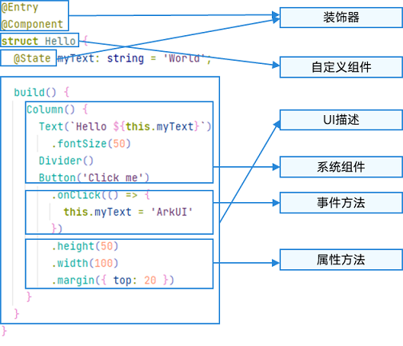

# UI范式

## **基础语法概述**

案例图片：

本示例中，ArkTS的基本组成如下所示。



>   说明
>
>   自定义变量不能与基础通用属性/事件名重复。

-   装饰器： 用于装饰类、结构、方法以及变量，并赋予其特殊的含义。如上述示例中@Entry、@Component和@State都是装饰器，[@Component](https://developer.huawei.com/consumer/cn/doc/harmonyos-guides/arkts-create-custom-components#component)表示自定义组件，[@Entry](https://developer.huawei.com/consumer/cn/doc/harmonyos-guides/arkts-create-custom-components#entry)表示该自定义组件为入口组件，[@State](https://developer.huawei.com/consumer/cn/doc/harmonyos-guides/arkts-state)表示组件中的状态变量，状态变量变化会触发UI刷新。
-   [UI描述](https://developer.huawei.com/consumer/cn/doc/harmonyos-guides/arkts-declarative-ui-description)：以声明式的方式来描述UI的结构，例如build()方法中的代码块。
-   [自定义组件](https://developer.huawei.com/consumer/cn/doc/harmonyos-guides/arkts-create-custom-components)：可复用的UI单元，可组合其他组件，如上述被@Component装饰的struct Hello。
-   系统组件：ArkUI框架中默认内置的基础和容器组件，可以直接调用，例如示例中的Column、Text、Divider、Button。
-   [属性方法](https://developer.huawei.com/consumer/cn/doc/harmonyos-references/ts-component-general-attributes)：组件可以通过链式调用配置多项属性，如fontSize()、width()、height()、backgroundColor()等。
-   [事件方法](https://developer.huawei.com/consumer/cn/doc/harmonyos-references/ts-component-general-events)：组件可以通过链式调用设置多个事件的响应逻辑，如跟随在Button后面的onClick()。

除此之外，ArkTS扩展了多种语法范式来使开发更加便捷：

-   [@Builder](https://developer.huawei.com/consumer/cn/doc/harmonyos-guides/arkts-builder)/[@BuilderParam](https://developer.huawei.com/consumer/cn/doc/harmonyos-guides/arkts-builderparam)：特殊的封装UI描述的方法，细粒度的封装和复用UI描述。
-   [@Extend](https://developer.huawei.com/consumer/cn/doc/harmonyos-guides/arkts-extend)/[@Styles](https://developer.huawei.com/consumer/cn/doc/harmonyos-guides/arkts-style)：扩展系统组件和封装属性样式，更灵活地组合系统组件。
-   [stateStyles](https://developer.huawei.com/consumer/cn/doc/harmonyos-guides/arkts-statestyles)：多态样式，可以依据组件的内部状态的不同，设置不同样式。

## 声明式UI描述

ArkTS以声明方式组合和扩展组件来描述应用程序的UI，同时还提供了基本的属性、事件和子组件配置方法，帮助开发者实现应用交互逻辑。

### 创建组件

根据组件构造方法的不同，创建组件包含有参数和无参数两种方式。

#### 无参数

如果组件接口定义中不包含必选构造参数，则组件后面的“()”不需要配置任何内容。例如：Divider组件不包含构造参数。

```
Column() {
  Text('item 1')
  Divider()
  Text('item 2')
}
```

#### 有参数

如果组件接口定义包含构造参数，则在组件后的“()”中配置相应参数。

-   Image组件的必选参数src。

```
Image('https://xyz/test.jpg')
```

-   Text组件的非必选参数content。

```
// string类型的参数
Text('test')
// $r形式引入应用资源，可应用于多语言场景
Text($r('app.string.title_value'))
// 无参数形式
Text()
```

-   变量或表达式可以用于参数赋值，表达式结果类型必须符合参数要求。

-   例如，设置变量或表达式来构造Image和Text组件的参数。

    ```
    Image(this.imagePath)
    // 此处需要替换为开发者所需的正确url
    Image('https://' + this.imageUrl)
    Text(`count: ${this.count}`)
    ```

### 配置属性

属性方法以“.”链式调用配置组件样式和其他属性，建议每个属性方法单独一行。

-   配置Text组件的字体大小。

```
Text('test')
  .fontSize(12)
```

-   配置组件的多个属性。

```
Image('test.jpg')
  .alt('error.jpg')
  .width(100)
  .height(100)
```

-   除了直接传递常量参数，还可以传递变量或表达式。

```
Text('hello')
  .fontSize(this.fontSize)
Image('test.jpg')
  .width(this.count % 2 === 0 ? 100 : 200)
  .height(this.offsetNum + 100)
```

-   对于系统组件，ArkUI还为其属性预定义了一些枚举类型供开发者调用，枚举类型可以作为参数传递，但必须满足参数类型要求。

例如，可以按以下方式配置Text组件的颜色和字体样式。

```
Text('hello')
  .fontSize(20)
  .fontColor(Color.Red)
  .fontWeight(FontWeight.Bold)
```

### 配置事件

事件方法以“.”链式调用的方式配置系统组件支持的事件，建议每个事件方法单独写一行。

-   使用箭头函数配置组件的事件方法。

```
Button('Click me')
  .onClick(() => {
    this.myText = 'ArkUI';
  })
```

-   使用箭头函数表达式配置组件的事件方法，要求使用“() => {...}”，以确保函数与组件绑定，同时符合ArkTS语法规范。

```
Button('add counter')
  .onClick(() => {
    this.counter += 2;
  })
```

-   使用组件的成员函数配置组件的事件方法，需要bind this。ArkTS语法不建议使用成员函数配合bind this来配置组件的事件方法。

```
  myClickHandler(): void {
    this.counter += 2;
  }

// ···
   Button('add counter')
     .onClick(this.myClickHandler.bind(this))
```

-   使用声明的箭头函数时可以直接调用，不需要bind this。

```
  fn = () => {
    hilog.info(0x0000, 'Declarative UI Description', `counter: ${this.counter}`);
    this.counter++;
  };

// ···
   Button('add counter')
     .onClick(this.fn)
```

>   说明
>
>   箭头函数内部的this是词法作用域，由上下文确定。匿名函数可能会出现this指向不明确的问题，因此在ArkTS中不允许使用。

### 配置子组件

如果组件支持子组件配置，则需在尾随闭包"{...}"中为组件添加子组件的UI描述。Column、Row、Stack、Grid、List等组件都是容器组件。

-   以下是简单的Column组件配置子组件的示例。

```
Column() {
  Text('Hello')
    .fontSize(100)
  Divider()
  Text(this.myText)
    .fontSize(100)
    .fontColor(Color.Red)
}
```

-   容器组件均支持子组件配置，可以实现相对复杂的多级嵌套。

```
Column() {
  Row() {
    Image('test1.jpg')
      .width(100)
      .height(100)
    Button('click +1')
      .onClick(() => {
        hilog.info(0x0000, 'Declarative UI Description', '+1 clicked!');
      })
  }
}
```

## **创建自定义组件**

在ArkUI中，UI显示的内容均为组件，由框架直接提供的称为系统组件，由开发者定义的称为自定义组件。

进行UI界面开发时，不仅要组合使用系统组件，还需考虑代码的可复用性、业务逻辑与UI的分离，以及后续版本的演进等因素。因此，将UI和部分业务逻辑封装成自定义组件是不可或缺的能力。

自定义组件具有以下特点：

-   可组合：允许开发者组合使用系统组件及其属性和方法。
-   可重用：自定义组件可以被其他组件重用，并作为不同的实例在不同的父组件或容器中使用。
-   数据驱动UI更新：通过状态变量的改变，来驱动UI的刷新。

### 自定义组件的基本用法

以下示例展示了自定义组件的基本用法。

```
@Component
struct HelloComponent {
  @State message: string = 'Hello, World!';

  build() {
    // HelloComponent自定义组件组合系统组件Row和Text
    Row() {
      Text(this.message)
        .onClick(() => {
          // 状态变量message的改变驱动UI刷新，UI从'Hello, World!'刷新为'Hello, ArkUI!'
          this.message = 'Hello, ArkUI!';
        })
    }
  }
}
```

>   注意
>
>   如果在其他文件中引用自定义组件，需要使用export关键字导出组件，并在使用的页面import该自定义组件。

可以在其他自定义组件的build()函数中多次创建HelloComponent，以实现自定义组件的重用。

```
@Entry
@Component
struct ParentComponent {
  build() {
    Column() {
      Text('ArkUI message')
      HelloComponent({ message: 'Hello World!' })
      Divider()
      HelloComponent({ message: 'Hello ArkTS!' })
    }
  }
}
```

### 自定义组件的基本结构

#### struct

自定义组件基于struct实现，struct + 自定义组件名 + {...}的组合构成自定义组件，不能有继承关系。对于struct的实例化，可以省略new。

>   说明
>
>   自定义组件名、类名、函数名不得与系统组件名重复。

#### @Component

@Component装饰器仅装饰struct关键字声明的数据结构。被装饰的struct具备组件化的能力，需要实现build方法描述UI，一个struct只能被一个@Component装饰。@Component可以接受一个可选的boolean类型参数。

```
@Component
struct MyComponent {
// ···
}
```

##### **freezeWhenInactive**

[组件冻结](https://developer.huawei.com/consumer/cn/doc/harmonyos-guides/arkts-custom-components-freeze)选项。

| 名称               | 类型    | 只读 | 可选 | 说明                                                         |
| :----------------- | :------ | :--- | :--- | :----------------------------------------------------------- |
| freezeWhenInactive | boolean | 否   | 否   | 是否开启组件冻结。默认值false。true表示开启组件冻结，false表示不开启组件冻结。 |

```
@Component({ freezeWhenInactive: true })
struct MyComponent {
// ···
}
```

#### @ComponentV2

为了在自定义组件中使用[状态管理V2版本](https://developer.huawei.com/consumer/cn/doc/harmonyos-guides/arkts-state-management-overview#状态管理v2)状态变量装饰器的能力，开发者可以使用@ComponentV2装饰器装饰自定义组件。

>   说明
>
>   @ComponentV2装饰器从API version 12开始支持。
>
>   从API version 12开始，该装饰器支持在元服务中使用。

和[@Component装饰器](https://developer.huawei.com/consumer/cn/doc/#component)一样，@ComponentV2装饰器用于装饰自定义组件：

-   在@ComponentV2装饰的自定义组件中，开发者仅可以使用全新的状态变量装饰器，包括[@Local](https://developer.huawei.com/consumer/cn/doc/harmonyos-guides/arkts-new-local)、[@Param](https://developer.huawei.com/consumer/cn/doc/harmonyos-guides/arkts-new-param)、[@Once](https://developer.huawei.com/consumer/cn/doc/harmonyos-guides/arkts-new-once)、[@Event](https://developer.huawei.com/consumer/cn/doc/harmonyos-guides/arkts-new-event)、[@Provider](https://developer.huawei.com/consumer/cn/doc/harmonyos-guides/arkts-new-provider-and-consumer)、[@Consumer](https://developer.huawei.com/consumer/cn/doc/harmonyos-guides/arkts-new-provider-and-consumer)等。
-   @ComponentV2装饰的自定义组件暂不支持[LocalStorage](https://developer.huawei.com/consumer/cn/doc/harmonyos-guides/arkts-localstorage)等现有自定义组件的能力。
-   无法同时使用@ComponentV2与@Component装饰同一个struct结构。
-   @ComponentV2支持一个可选的boolean类型参数freezeWhenInactive，来实现[组件冻结功能](https://developer.huawei.com/consumer/cn/doc/harmonyos-guides/arkts-custom-components-freezev2)。
-   一个简单的@ComponentV2装饰的自定义组件应具有以下部分：

```
@Entry
@ComponentV2 // 装饰器
struct ComponentV2Test { // struct声明的数据结构
  @Local message: string = 'Hello World';
  build() { // build定义的UI
    RelativeContainer() {
      Text(this.message)
        .id('HelloWorld')
        // $r('app.float.page_text_font_size')需要替换为开发者所需的资源文件;
        .fontSize($r('app.float.page_text_font_size'))
        .fontWeight(FontWeight.Bold)
        .alignRules({
          center: { anchor: '__container__', align: VerticalAlign.Center },
          middle: { anchor: '__container__', align: HorizontalAlign.Center }
        })
        .onClick(() => {
          this.message = 'Welcome';
        })
    }
    .height('100%')
    .width('100%')
  }
}
```

除非特别说明，@ComponentV2装饰的自定义组件将与@Component装饰的自定义组件保持相同的行为。

#### build()函数

build()函数用于定义自定义组件的声明式UI描述，自定义组件必须定义build()函数。

```
@Component
struct MyComponent {
  build() {
    // ···
  }
}
```

#### @Entry

@Entry装饰的自定义组件将作为UI页面的入口。在单个UI页面中，仅允许存在一个由@Entry装饰的自定义组件作为页面的入口。@Entry可以接受一个可选的[LocalStorage](https://developer.huawei.com/consumer/cn/doc/harmonyos-guides/arkts-localstorage)参数。

```
@Entry
@Component
struct MyComponent {
// ···
}
```

##### **EntryOptions**

命名路由跳转选项。

| 名称             | 类型                                                         | 只读 | 可选 | 说明                                                         |
| :--------------- | :----------------------------------------------------------- | :--- | :--- | :----------------------------------------------------------- |
| routeName        | string                                                       | 否   | 是   | 表示作为命名路由页面的名字。                                 |
| storage          | [LocalStorage](https://developer.huawei.com/consumer/cn/doc/harmonyos-guides/arkts-localstorage) | 否   | 是   | 页面级的UI状态存储。当未传入时，框架会创建一个新的LocalStorage实例作为默认值。 |
| useSharedStorage | boolean                                                      | 否   | 是   | 是否使用[loadContent](https://developer.huawei.com/consumer/cn/doc/harmonyos-references/arkts-apis-window-windowstage#loadcontent9)传入的LocalStorage实例对象。默认值false。true：使用共享的[LocalStorage](https://developer.huawei.com/consumer/cn/doc/harmonyos-guides/arkts-localstorage)实例对象。false：不使用共享的[LocalStorage](https://developer.huawei.com/consumer/cn/doc/harmonyos-guides/arkts-localstorage)实例对象。 |

>   说明
>
>   当useSharedStorage设置为true且storage已赋值时，useSharedStorage的值优先级更高。

```
@Entry({ routeName: 'myPage' })
@Component
struct MyComponent {
// ···
}
```

####  @Reusable

@Reusable装饰的自定义组件具备可复用能力。详细请参考：[@Reusable装饰器：组件复用](https://developer.huawei.com/consumer/cn/doc/harmonyos-guides/arkts-reusable#使用场景)。

```
@Reusable
@Component
struct MyComponent {
// ···
}
```

#### 成员函数/变量

自定义组件除了必须要实现build()函数外，还可以实现其他成员函数，成员函数具有以下约束：

-   自定义组件的成员函数仅能从组件内部访问，且不建议声明为静态函数。

自定义组件可以包含成员变量，成员变量具有以下约束：

-   自定义组件的成员变量仅能从组件内部访问，且不建议声明为静态变量。
-   自定义组件的成员变量本地初始化有些是可选的，有些是必选的。具体是否需要本地初始化，是否需要从父组件通过参数传递初始化子组件的成员变量，请参考[状态管理](https://developer.huawei.com/consumer/cn/doc/harmonyos-guides/arkts-state-management-overview)。

#### 自定义组件的参数规定

以下示例展示了如何在build方法里创建自定义组件，并在创建自定义组件的过程中，根据装饰器的规则来初始化自定义组件的参数。

```
@Component
struct MyComponent {
  private countDownFrom: number = 0;
  private color: Color = Color.Blue;

  build() {
    Column() {
      Text(`${this.countDownFrom}`)
        .backgroundColor(this.color)
    }
  }
}

@Entry
@Component
struct ParentComponent {
  private someColor: Color = Color.Pink;

  build() {
    Column() {
      // 创建MyComponent实例，并将创建MyComponent成员变量countDownFrom初始化为10，将成员变量color初始化为this.someColor
      MyComponent({ countDownFrom: 10, color: this.someColor })
    }
  }
}
```

以下示例代码将父组件中的函数传递给子组件，并在子组件中调用。

```
@Entry
@Component
struct Parent {
  @State cnt: number = 0;
  submit: () => void = () => {
    this.cnt++;
  };

  build() {
    Column() {
      Text(`${this.cnt}`)
      Son({ submitArrow: this.submit })
    }
  }
}

@Component
struct Son {
  submitArrow?: () => void;

  build() {
    Row() {
      Button('add')
        .width(80)
        .onClick(() => {
          if (this.submitArrow) {
            this.submitArrow()
          }
        })
    }
    .height(56)
  }
}
```

