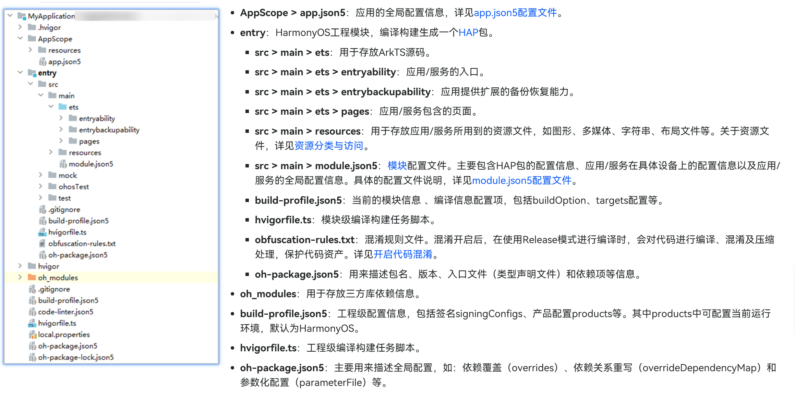

# 前言

鸿蒙开发者学堂学习地址：[HarmonyOS鸿蒙课程学习-鸿蒙应用开发系列课-华为开发者学堂](https://developer.huawei.com/consumer/cn/training/result?courseType=5&type1List=101718934267126043)

开发指南：[开发准备-快速入门-基础入门 - 华为HarmonyOS开发者](https://developer.huawei.com/consumer/cn/doc/harmonyos-guides/start-overview)

API参考：https://developer.huawei.com/consumer/cn/doc/harmonyos-references/syscap

示例代码：[HarmonyOS示例代码-鸿蒙系统示例代码-华为开发者联盟](https://developer.huawei.com/consumer/cn/samples/)

## 开源实践项目

「星辰云巡」是一款使用 ArkTS 开发的开源 HarmonyOS 服务器监控客户端，包含响应式布局、多主题、二维码绑定、安全凭据存储、实时数据、历史趋势和告警管理等完整实践。

- [在华为应用市场体验星辰云巡](https://appgallery.huawei.com/app/detail?id=cn.xciy.xcyx&channelId=SHARE&source=appshare)
- [查看项目源码与开发说明](https://github.com/Pstarchen/xingchenyunxun)

# 工程目录讲解

